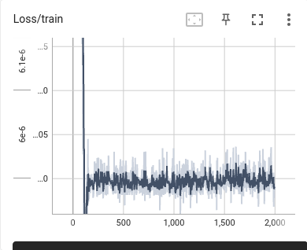

### XJTU RoboCon2025 R1 Basketball Shooter Control Project

#### Introduction

This is XJTU Robocon 2025 R1 basketball shooter control project 
In this project we use **neural network** to control the velocity of three motors to control friction tapes. By these friction tapes, the basketball can be shot into the rim.

#### Some Images
**Image 1 The Loss in Test**
 
**Image 2 The Loss in Train**
